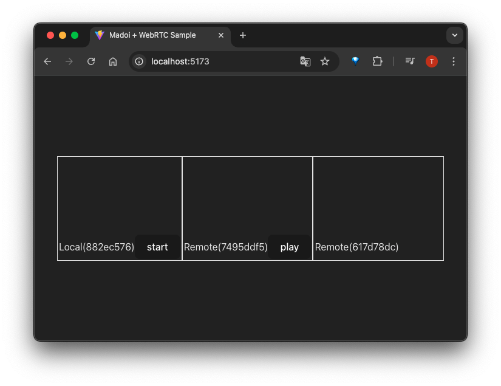

# madoi-sample-ts-react-webrtc-simple

WebRTCを使って映像と音声を送受信するサンプルアプリケーションです。
複数人でのビデオ会議が行えます。
シグナリングサーバには、<a href="https://github.com/kcg-edu-future-lab/madoi">Madoi</a>を利用しています。

画面例:


- `start`ボタンをクリックすると音声と映像の送信を開始します。
- ブラウザのセキュリティ機能により、受信した映像が表示されない場合があります。`play`ボタンをクリックすると表示されます。

# 機能

シンプルなビデオ会議サンプルアプリです。以下の機能が実装されています。

- Madoiによるシグナリング
  - <a href="https://github.com/kcg-edu-future-lab/madoi">Madoi</a>サーバを利用し、WebRTC接続の確立に必要なメッセージを送受信します。
- 音声と映像の送信開始/停止
  - `Start`ボタンをクリックすると、マイクとカメラを取得し、音声と映像を他の参加者に送信します。

ブラウザのWebRTC APIのみを仕様しており、他のライブラリやサービスは使用していません。

# 動作環境

Chromeでの動作確認を行なっています。

静的ビルド(node.js v22以降が必要)に対応しているため、ビルド結果をWebサーバに設置してChromeでアクセスすれば利用できます。

動作にはMadoiサーバが必要です。ローカルで一式起動(以下、`サンプルアプリの起動`参照)するには、docker-compose が必要です。

# 実行方法

## Madoiの起動

適当なディレクトリで以下のコマンドを実行し、Madoi の madoi-volatileserver を起動してください。詳細は、[MadoiのREADME](https://github.com/kcg-edu-future-lab/madoi)を参照してください。


```bash
git clone https://github.com/kcg-edu-future-lab/madoi
cd madoi
docker compose up
```

`docker compose up`を実行すると、Madoiのビルドが行われ、volatileserverが起動します。


## サンプルアプリのcloneと設定変更

まず、このリポジトリをcloneしてください。

```bash
git clone https://github.com/kcg-edu-future-lab/madoi-sample-ts-react-webrtc-simple
cd madoi-sample-ts-react-webrtc-simple
```

次に /src/keys.ts.sample をコピーして、 /src/keys.ts を作成し編集して、適切に設定を行なってください。

```ts
// Madoi設定
export const madoiUrl = "ws://localhost:8080/madoi/rooms";
export const madoiKey = "MADOI_API_KEY";
```

MadoiサーバのデフォルトのMADOI_API_KEYは、[docker-compose.yml](https://github.com/kcg-edu-future-lab/madoi/blob/master/docker-compose.yml)を参照してください。


## サンプルアプリの起動

次に以下のコマンドを実行すると、コンテナ内でPresenceが起動します。
このコマンドは、Node.jsのバージョン22のイメージ(node:22)を使用して、Presenceを開発モードで起動(`npm run dev`)するものです。

```bash
docker compose up
```

起動後、http://localhost:5137/ にアクセスすると、サンプルアプリをブラウザで利用できます(ポートを変更するには、vite.config.ts.dockerファイルを編集してください)。

node.jsをローカル環境にセットアップすれば、ローカルでの開発モード起動(`npm run dev`)や静的ビルド(`npm run build`)も可能です。
Webサーバに配備する場合は、madoi-volatileserverもサーバに配備し、そのURLとキーを `keys.ts` に設定して静的ビルドを行い、distディレクトリ内のビルド結果をWebサーバに配置してください。
